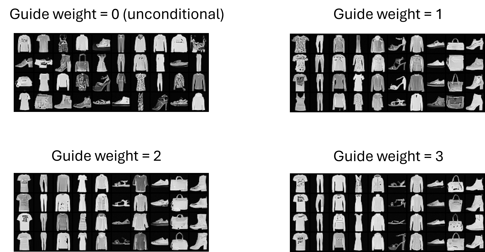

# Classifier-Free Guidance Flow Matching on FashionMNIST

This repository contains the implementation of classifier-free guidance flow matching on the FashionMNIST dataset, modifying the guidance equation as described in the original research.

## Requirements

- `pytorch`
- `numpy`
- `tqdm`
- `matplotlib`

## Usage

To train the model and perform sampling, run the following command:

```bash
python train_sample_fashion.py
```


## Modifications to Guidance 

In this implementation, the guidance equation is modified as follows: `eps = (guide_w)*eps1 + (1-guide_w)*eps2`.
This replaces the original equation: `eps = (1+guide_w)eps1 - guide_weps2` as described in the paper [Classifier-Free Diffusion Guidance] (https://arxiv.org/abs/2207.12598). Additionally, the flow matching model employs a conditional optimal-transport (linear) path and uses the midpoint method as the ODE solver, as discussed in the paper [Flow Matching Guide and Code] (https://arxiv.org/abs/2412.06264). 

## Results
The guidance result is shown following.  
